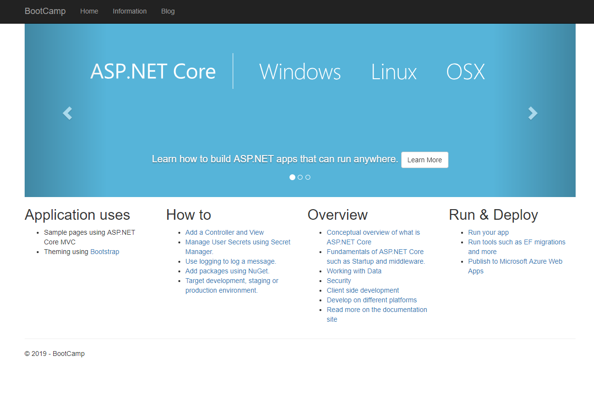
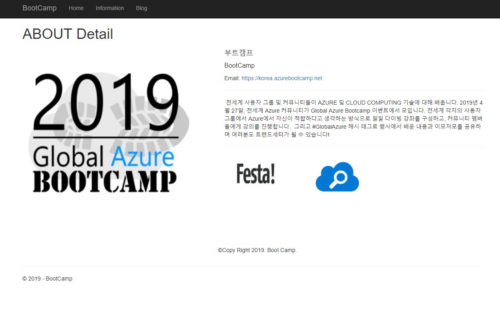
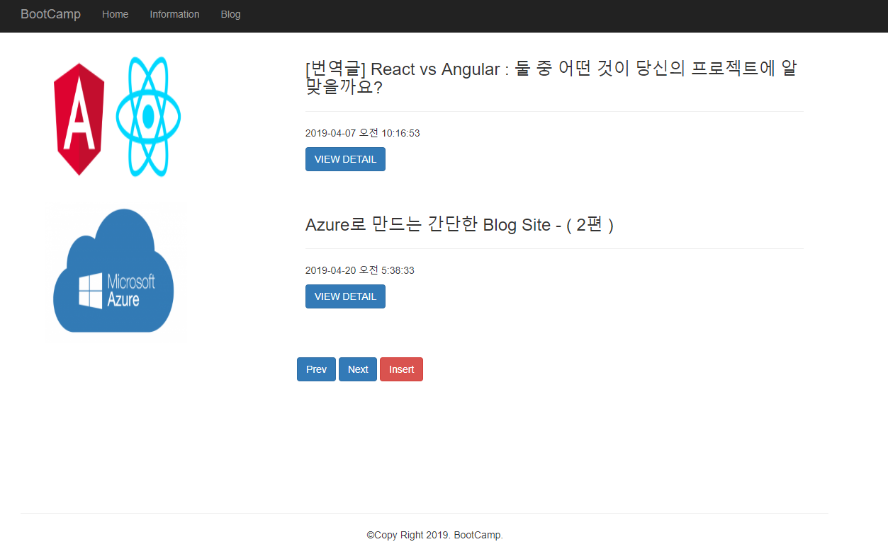
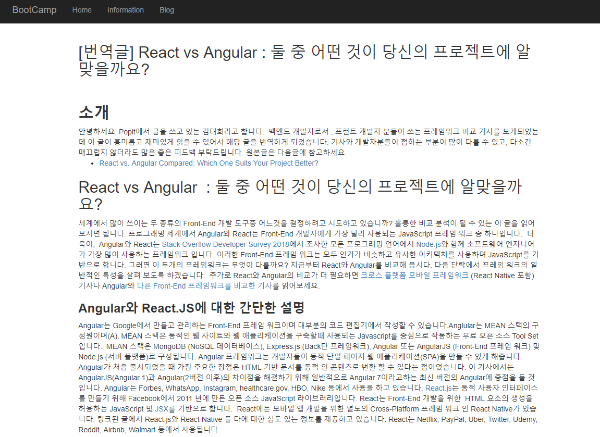
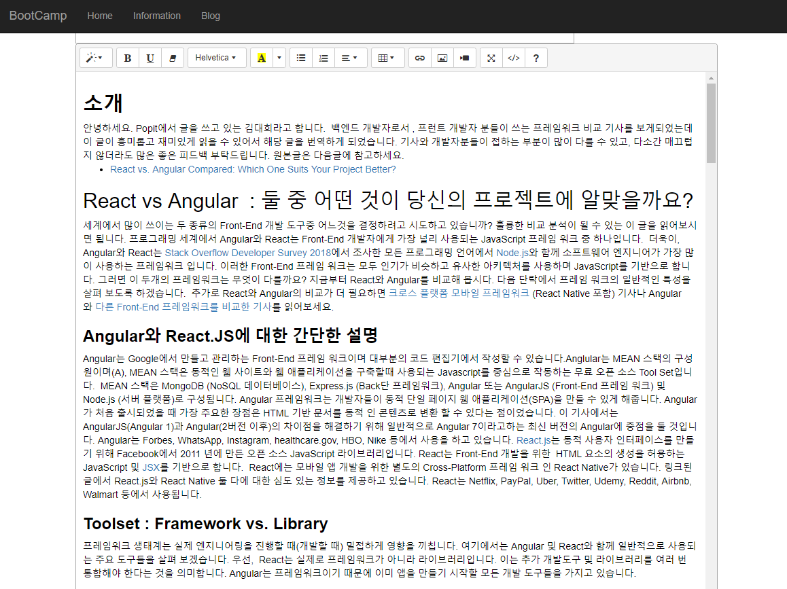

# AzureBootCamp
### Azure를 이용한 간단한 블로그 만들기 여정의 공개 소스입니다.

- Net Core 2.1
- Mysql  + Net Core
- Design은 기본 생성시 사용되는 Bootstrap 만을 이용하였습니다.

## MYSQL 연동시 Nuget 의존성 작업

연동 방법 [링크](https://www.nuget.org/packages/Pomelo.EntityFrameworkCore.MySql/2.1.0) 

## 작업 기능

- 메인 화면
- 상세 화면 ( XML 파싱 )
- 블로그 글 목록
- 블로그 글 상세확인
- 블로그 글 수정
- 블로그 글 작성
- 블로그 글 삭제

## 템플릿 화면 ( 소스 실행시 화면입니다. )

