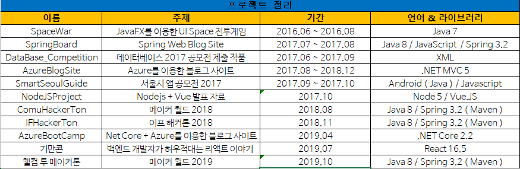

# PortFolio Repo
### 지금까지 만들었던 Project 및 발표자료가 올라오는 Repo입니다.

- 프로젝트 설명 링크 : https://daeheekim.azurewebsites.net/

  

### 2016년

- Space War ( JavaFX를 이용한 UI Space 전투게임 )

  - JavaFX ( Java 7 )

    

### 2017년

- Spring Board ( Spring Web Blog Site )

  - Java 8
  - Spring 3.2
  - Javascript ( Jquery 3.2.1 )

- DataBase_Competition ( 데이터베이스 2017 공모전 )

  - XML ( ERD )

- SmartSeoulGuide ( 서울시 앱 공모전 - 예선당선작 )

  - Android ( Java )
  - Javascript ( Jquery )

- NodeJS Project

  - 연합동아리 Node + Vue 발표자료 예시

  - Node.js + Vue.js

    

### 2018년

- ComuHackTon  ( 메이커 월드 2018 - 우수상 )
  - Java 8 
  - Spring ( Maven )
- IFHackerTon ( 이프해커톤 2018 - 국회 교육위원장상 )
  - Java 8
  - Spring ( Maven )

### 2019년

- AzureBootCamp ( Azure BootCamp 2019 )
  - 주제 : Azure Net Core 2.2로 만드는 블로그 사이트
  - 링크 : https://festa.io/events/213
- 기만콘 ( 기만콘 2019 )
  - 주제 : 백엔드 개발자가 허우적대는 리액트 이야기
  - 링크 : http://www.fairbrite.com/DevStarLeague/events/12